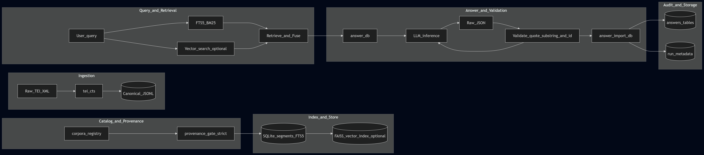

# SCRIPTORIUM

Local-first, reproducible Digital Humanities pipeline for building a structured, searchable corpus database (SQLite + FTS5, optional vectors) with an **audit-traceable** LLM answer layer that **fails closed** on hallucinated citations.



## What this is for

- Build and maintain a **defensible** local text database from historical-language corpora.
- Preserve an **archival intermediate** (canonical JSONL) and treat SQLite/vector indexes as **derived artifacts**.
- Support hybrid retrieval (FTS5 BM25 + optional vectors) and an optional LLM layer whose citations are **mathematically constrained**:
  - `citation.quote` must be a literal substring of the cited passage text (after Unicode normalization).

## Source of truth (do not drift)

Read these first:

- `docs/PROJECT_CONTEXT.md` — living project state and next steps
- `docs/DECISIONS.md` — non-negotiable constraints
- `docs/HANDOFF.md` — how to continue work in a new chat/session

## Repository discipline (important)

Do **not** commit generated artifacts:

- `.venv*`
- `data_raw/`
- `data_proc/`
- `db/`
- `indexes/`
- `runs/`
- `data_gen/`

Exception: small curated fixtures intended for CI (e.g., under `tests/fixtures/`).

## Architecture highlights

- **Canonical JSONL is authoritative.** One record per segment; deterministic output; no silent mutation.
- **Canonical segment IDs are enforced.** `segments.id` must be `<corpus_id>:<local_id>` (exactly one colon).
- **Lexical retrieval is SQLite FTS5 only.** (Legacy BM25 pickle artifacts are not part of the contract.)
- **Provenance gate at DB build.** `db-build` verifies `canon_jsonl.sha256` recorded in `docs/corpora.json` against the on-disk JSONL; `--strict-provenance` requires hashes for all executable corpora.
- **CI never calls an LLM.** CI uses seeded fixtures for answer/gloss pipeline tests.

---

# Quickstart demo (works from a clean checkout)

This repo ships:

- Tiny committed demo canon: `sample_data/data_proc/oe_bede_sample_utf8.jsonl`
- Public registry pointing only at committed demo data: `docs/corpora.public.json`

Because the default registry (`docs/corpora.json`) often points at local-only corpora under `data_proc/`, the demo and CI run by temporarily swapping in the public registry.

## Step 0 — Use the public registry (temporary swap)

```powershell
Copy-Item docs\corpora.public.json docs\corpora.json -Force
```

## Option A — Demo config (downloads embedding model during run)

```powershell
python -m scriptorium doctor    --config configs\sample_demo_ci.toml --json
python -m scriptorium db-build  --config configs\sample_demo_ci.toml --overwrite
python -m scriptorium vec-build --config configs\sample_demo_ci.toml --out-dir indexes\vec_faiss_global --batch 16
python -m scriptorium db-search --config configs\sample_demo_ci.toml --q "lareow" --k 3 --corpus oe_bede_sample
python -m scriptorium retrieve  --config configs\sample_demo_ci.toml --q "What is said about the lareow?" --k 5 --corpus oe_bede_sample
python -m scriptorium answer-db --config configs\sample_demo_ci.toml --q "What is said about the lareow?" --k 5 --corpus oe_bede_sample --dry-run
```

## Optional — Seed an answer run and test answer-search (no LLM required)

`answer-search` only searches imported answers (`answers_fts`). To smoke-test the answer import/search chain without calling an LLM:

```powershell
@'
from pathlib import Path
import json

run = Path("runs/answer_db/20000101_000000_seed_king")
run.mkdir(parents=True, exist_ok=True)

(run / "meta.json").write_text(
    json.dumps({"run_id": run.name, "corpus_filter": "oe_bede_sample"}, ensure_ascii=False, separators=(",", ":")),
    encoding="utf-8",
)
(run / "retrieval.json").write_text(
    json.dumps({"query": "king", "corpus": "oe_bede_sample"}, ensure_ascii=False, separators=(",", ":")),
    encoding="utf-8",
)
(run / "answer.json").write_text(
    json.dumps({"answer": "Seeded answer containing king (smoke test).", "citations": [], "notes": []}, ensure_ascii=False, separators=(",", ":")),
    encoding="utf-8",
)
(run / "validation.json").write_text("{}", encoding="utf-8")

print(str(run))
'@ | python
```

Import, check FTS, then search (use prefix queries):

```powershell
python -m scriptorium answer-import-db --config configs\sample_demo_ci_strict.toml --run-dir runs\answer_db\20000101_000000_seed_king
python -m scriptorium check-ai-fts      --config configs\sample_demo_ci_strict.toml --json
python -m scriptorium answer-search     --config configs\sample_demo_ci_strict.toml --q "king*" --k 10 --corpus oe_bede_sample
```

For real answer generation (non-dry-run), configure an LLM endpoint and run `answer-db` without `--dry-run`, then import the printed run directory.

## Option B — Strict local-first config (embedding model must already be on disk)

Provision the model once (creates `models/all-MiniLM-L6-v2/`):

```powershell
@'
from sentence_transformers import SentenceTransformer
m = SentenceTransformer("sentence-transformers/all-MiniLM-L6-v2")
m.save("models/all-MiniLM-L6-v2")
print("saved model -> models/all-MiniLM-L6-v2")
'@ | python
```

Run the same pipeline with strict doctor:

```powershell
python -m scriptorium doctor    --config configs\sample_demo_ci_strict.toml --strict --json
python -m scriptorium db-build  --config configs\sample_demo_ci_strict.toml --overwrite --strict-provenance
python -m scriptorium vec-build --config configs\sample_demo_ci_strict.toml --out-dir indexes\vec_faiss_global --batch 16
python -m scriptorium db-search --config configs\sample_demo_ci_strict.toml --q "lareow" --k 3 --corpus oe_bede_sample
python -m scriptorium retrieve  --config configs\sample_demo_ci_strict.toml --q "What is said about the lareow?" --k 5 --corpus oe_bede_sample
python -m scriptorium answer-db --config configs\sample_demo_ci_strict.toml --q "What is said about the lareow?" --k 5 --corpus oe_bede_sample --dry-run
```

## Step final — Restore the tracked registry file

```powershell
git checkout -- docs\corpora.json
```

---

# Using Scriptorium on local corpora

## 1) Ingest → canonical JSONL (untracked)

Canonical JSONL is the authoritative archival intermediate. It lives under `data_proc/` (untracked).

- TEI/CTS ingest wrapper: `src/ingest/ingest_tei_cts.py`
- Shared TEI/CTS logic: `src/scriptorium/ingest/tei_cts.py`

Example (TEI XML → canonical JSONL):

```powershell
python src\ingest\ingest_tei_cts.py --tei path\to\work.xml --corpus-id my_corpus --out data_proc\my_corpus_prod.jsonl --lang lat
```

## 2) Register corpus + record provenance/rights (tracked)

Update `docs/corpora.json` for the new corpus:

- `canon_jsonl.path`
- `canon_jsonl.sha256`
- rights tier/license/distributable flags

Do not guess URLs/licenses; if unknown, mark as TODO and keep it non-executable.

## 3) Build DB (derived; untracked)

```powershell
python -m scriptorium db-build --config <your_config.toml> --overwrite --strict-provenance
```

If hashes do not match, the build fails hard.

## 4) Search (FTS5)

```powershell
python -m scriptorium db-search --config <your_config.toml> --q "query" --k 10 --corpus my_corpus
```

## 5) Optional: build vectors and use hybrid retrieval

```powershell
python -m scriptorium vec-build --config <your_config.toml> --out-dir indexes\vec_faiss_global --batch 16
python -m scriptorium retrieve  --config <your_config.toml> --q "question" --k 8 --corpus my_corpus
```

---

# LLM answer generation (optional, audit-traceable)

The answer layer is optional and must remain audit-traceable:

1) Generate a run directory (records prompts, retrieval, raw model outputs, and validation):

```powershell
python -m scriptorium answer-db --config <your_config.toml> --q "question" --k 8 --corpus my_corpus
```

2) Import answers into SQLite for `answer-search`:

```powershell
python -m scriptorium answer-import-db --config <your_config.toml> --run-dir runs\answer_db\<run_id_dir>
```

3) Search imported answers and show citations:

```powershell
python -m scriptorium answer-search --config <your_config.toml> --q "term*" --k 10 --corpus my_corpus --show-cites
python -m scriptorium answer-show   --config <your_config.toml> --run-id <run_id> --max-cites 5 --chars 220
```

## LLM endpoint configuration

You can pass CLI flags or use environment variables (OpenAI-compatible local server supported):

- `SCRIPTORIUM_LLM_BASE_URL` (default: `http://localhost:1234/v1`)
- `SCRIPTORIUM_LLM_MODEL` (if empty, Scriptorium may try `/models`)
- `SCRIPTORIUM_LLM_API_KEY` (default: `lm-studio`)

---

# CI

GitHub Actions uses the strict path:

- provisions `models/all-MiniLM-L6-v2/`
- swaps `docs/corpora.public.json` into place as `docs/corpora.json`
- runs strict doctor + build + smoke (including a seeded answer import/search to exercise `answer-import-db`, `answers_fts`, and `answer-search`)

See `.github/workflows/ci.yml` for the exact sequence.

---

# LLM use disclosure

This project was developed with assistance from large language models (LLMs) used as a coding copilot and for drafting certain documentation and utilities. The repository also includes optional LLM-powered features (e.g., `answer-db`) that are designed to be audit-traceable via saved prompts, raw model responses, and retrieval/citation JSON. Any LLM-generated outputs should be treated as machine-generated and verified as appropriate for your use case.
